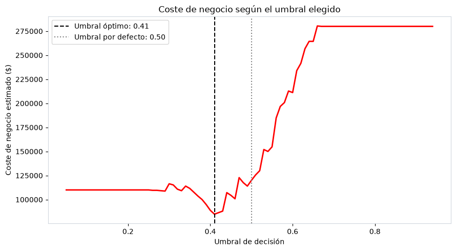

# Credit Risk Model — Delinquent Borrower Detection

*Credit scoring* model to predict the probability of default for credit card applicants, optimized to **minimize real business cost** (not just statistical accuracy).

> **Key result:** the final model, with its decision threshold calibrated to business cost (0.41), **reduces the portfolio's expected cost by ~29%** compared to using the default threshold (0.50), detecting **94.3% of actual delinquent borrowers** in the test set.


- Optimal threshold based on business cost: 0.41
- Estimated cost at optimal threshold: $84,800
- Estimated cost at default threshold (0.50): $120,000
- Potential savings: $35,200 just by choosing the right threshold

## 📌 The Business Problem

A bank loses money in two ways when evaluating credit applications:

| Error                     | Description                                   | Assumed Cost  |
|---                        |---                                            |---            |
| **False Negative (FN)**   | Approving a customer who turns out to default | **$8,000**    |
| **False Positive (FP)**   | Rejecting a customer who would have paid      | **$400**      |

An FN costs **20 times more** than an FP. That's why the goal wasn't to maximize Accuracy, but to **maximize Recall** (catch as many actual delinquent borrowers as possible) and then **calibrate the decision threshold to real cost**, rather than the default 0.5 used in most tutorials.

## 📊 Results

### Model Benchmark (5 algorithms, with overfitting diagnostics)

| Model                     | ROC-AUC   | Recall    | Overfitting Gap (ROC-AUC) |
|---                        |---        |---        |---                        |
| **Random Forest** ✅      | **75.2%** | 68.6%     | 10.1 pts                  |
| Logistic Regression (L2)  | 64.8%     | 68.6%     | 0.6 pts                   |
| LightGBM                  | 80.7%     | 60.0%     | 15.1 pts                  |
| XGBoost                   | 72.7%     | 54.3%     | 18.6 pts                  |
| Decision Tree             | 65.1%     | 48.6%     | 3.2 pts                   |

**Random Forest** was selected as the final model: same Recall as Logistic Regression, but 10 points higher discriminative power (ROC-AUC), with a controlled overfitting level well below that of the boosting models (which overfit more despite regularization — an interesting finding given the dataset's small size).

### Economic Impact of the Optimal Threshold

|                               | Threshold 0.50 (default)  | Threshold 0.41 (optimal)  |
|---                            |---                        |---                        |
| False Negatives               | 11                        | **2**                     |
| False Positives               | 80                        | 172                       |
| **Estimated Cost**            | $120,000                  | **$84,800**               |
| Recall (default detection)    | 68.6%                     | **94.3%**                 |

## 🔍 Methodology

1. **Data cleaning** — detection and treatment of a critical sentinel value (`Employed_days = 365243`), which, if left unidentified, would have distorted the entire model.
2. **Data leakage prevention** — all statistics for imputation, outlier handling, and scaling are calculated exclusively on the training set and then applied to the test set.
3. **Imputation** — median grouped by the relevant categorical variable (not global median).
4. **Outlier treatment** — Interquartile Range (IQR) capping / Winsorization, evaluated variable by variable (with business judgment, not applied blindly).
5. **Multicollinearity (VIF)** — analysis on numerical variables prior to *one-hot encoding*.
6. **5 models compared**: Logistic Regression, Decision Tree, Random Forest, XGBoost, LightGBM — all with balanced `class_weight`/`scale_pos_weight` and tuned via `GridSearchCV`.
7. **Overfitting diagnostics at every stage** (train vs. test), not just at the end — with correction via regularization and complexity hyperparameters.
8. **Interpretability**: coefficients + odds ratios for the linear model, `feature_importances_` + SHAP for the tree-based model — including a critical review of potentially biased variables (e.g., gender) and their regulatory implications in *credit scoring*.
9. **Decision threshold optimization** based on an explicit business cost function, not the default 0.5.
10. **Production simulation** — automated Approve/Reject decisions on new applications.

## 🛠️ Tech Stack

- Python
- Pandas
- Scikit-learn
- XGBoost
- LightGBM
- SHAP
- Statsmodels (VIF)
- Matplotlib
- Seaborn

## 📁 Repository Structure

```text
.
├── data
│   ├── interim
│   ├── processed
│   └── raw
│       ├── Credit_card.csv
│       └── Credit_card_label.csv
├── environment.yml
├── images
│   └── umbral_decision.png
├── models
├── notebooks
│   └── riesgo_credito.ipynb
├── README.md
├── reports
│   └── figures
└── src

11 directories, 6 files
```

## ▶️ How to Reproduce

Clone the repository:

```bash
git clone https://github.com/antonio-xrp/riesgo_credito.git
```

Enter the project directory:

```bash
cd riesgo_credito
```

Create the Conda environment from the `environment.yml` file:

```bash
conda env create -f environment.yml
```

Activate the environment:

```bash
conda activate riesgo_credito
```

## 🧠 Key Takeaways

- A model with **higher Accuracy isn't always the best model for the business** — the winning model has the lowest Accuracy of the five (43.9% at the optimal threshold), yet generates the lowest cost.
- **Regularization affects bagging vs. boosting very differently** on small datasets: Random Forest generalized better than XGBoost/LightGBM even after applying equivalent complexity controls.
- Detecting and fixing **data leakage** (correct order of imputation/split) can substantially change reported results — a common mistake even in published projects.

## 👨‍💻 Author

**Antonio Palacios**

**Industrial Engineer | Data Analyst | Data Scientist**

- GitHub: [Antonio Palacios](https://github.com/antonio-xrp)
- LinkedIn: [Antonio Palacios](https://www.linkedin.com/in/antonio-palacios-orihuela-xrp/)
- Email: palaciosorihuelaantonio@gmail.com